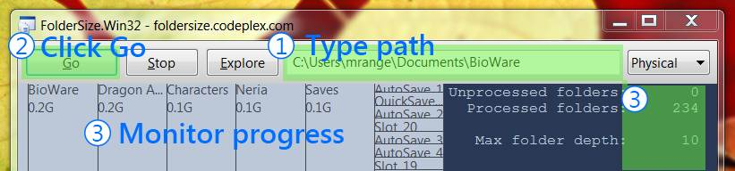

FolderSize is intended to be a simple application to determine what folders takes up place on your machine and to present it to you graphically.

* FolderSize.Win32.1.1.0.0 : [http://foldersize.codeplex.com/releases/view/65123](http://foldersize.codeplex.com/releases/view/65123)
	* Beta release, contains minor bugfixes and enhancements
* FolderSize.Win32.1.0.7.0 : [http://foldersize.codeplex.com/releases/view/41473](http://foldersize.codeplex.com/releases/view/41473)
	* The current stable release
	* FolderSize.Win32 should work on all Windows versions from Windows XP and up without any extra installations
* FolderSize.WPF : [http://foldersize.codeplex.com/releases/view/34675](http://foldersize.codeplex.com/releases/view/34675)
	* FolderSize.WPF requires .NET 3.5: [http://www.microsoft.com/downloads/details.aspx?FamilyId=AB99342F-5D1A-413D-8319-81DA479AB0D7](http://www.microsoft.com/downloads/details.aspx?FamilyId=AB99342F-5D1A-413D-8319-81DA479AB0D7)

## FolderSize.Win32 - Snapshot

# Roadmap FolderSize

## FolderSize.Win32
* Status: Mature
* A foldersize application written in C++ with the explicit intent to reduce the system requirements to a minimum to further reduce deployment pain.
* For those that are interested the source is of course available from codeplex although you need boost to compile it ([www.boost.org](www.boost.org)). I will arrange a setup environment subproject later on.

## FolderSize.Console
* Status: Stalled
* A foldersize application written in C++ with the explicit intent to reduce the system requirements to a minimum to further reduce deployment pain.
* Console UI to be usuable on headless windows servers

